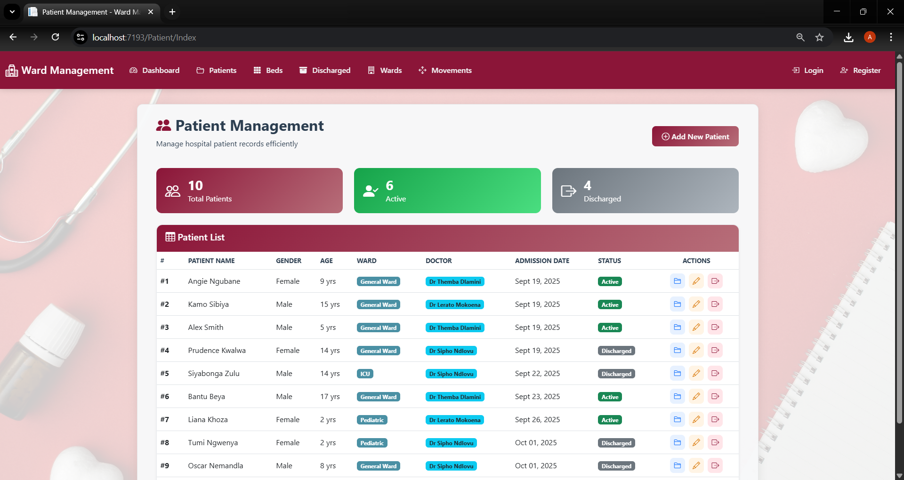
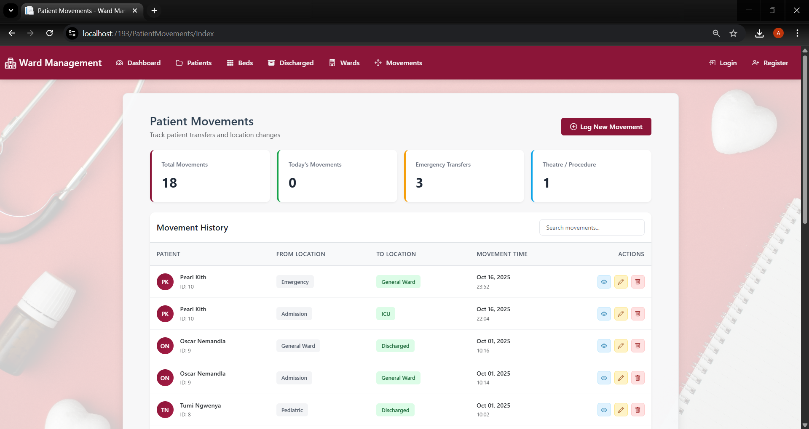

# Patient Management System

A hospital dashboard and patient management system built with **ASP.NET Core MVC**, **Entity Framework**, and **Bootstrap**.  
This project demonstrates a full-featured system for managing patient admissions, movements, and records in a ward.

---

## Features
- **Dashboard:** Quick overview of patients, beds, and admissions.
- **Patient List:** View and manage all patient records.
- **Patient Movement:** Track patient movements within the ward.
- **New Admission:** Add new patients and manage their folder details.
- Responsive design using Bootstrap for desktop and tablet screens.

---

## Tech Stack
- ASP.NET Core MVC
- Entity Framework Core
- Bootstrap 5
- SQL Server / LocalDB

---

## Screenshots

### Dashboard

### Patient List

### Patient Movement

### New Admission

---

## How to Run
1. Open the project in **Visual Studio**.
2. Restore **NuGet packages**.
3. Build the project.
4. Run using **IIS Express** or **Kestrel server**.
5. Navigate the dashboard to view, add, or manage patients.
